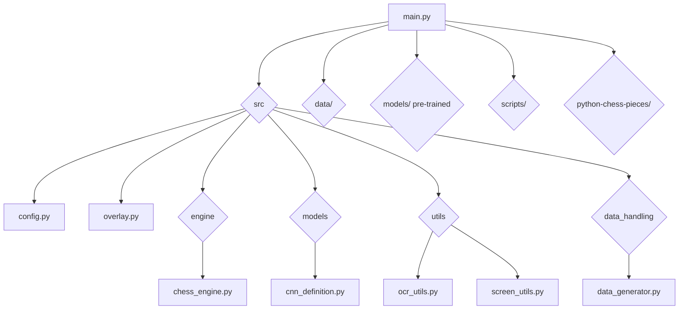

# OCR Chess - Computer Vision Chess Assistant

**Disclaimer & Ethical Use**: This project is developed solely for educational purposes, aiming to explore computer vision techniques (like screen scraping and template matching), GUI development (with PyQt6), and chess engine integration (Stockfish). It is **NOT** intended for use in any way that violates the terms of service of chess platforms or compromises the principles of fair play.

- **No Automation**: The tool intentionally lacks features for automated mouse control or direct interaction with chess interfaces. Including such capabilities would facilitate cheating, which I strongly discourage.
- **Educational Focus**: Use this project to learn about the underlying technologies, analyze your own past games (e.g., from screenshots or recordings), or experiment with computer vision on chess positions.
- **Prohibited Use**: Do **NOT** use this software to gain an unfair advantage in live games (online or over-the-board), tournaments, or any rated matches. Respect the rules of chess communities and platforms.

By using this software, you agree to employ it responsibly and ethically, strictly for learning and analysis purposes.

## Key Features

- **Pure Computer Vision Approach**: Analyzes chess positions from any screen source without relying on browser automation or specific website integrations.
- **Versatile Compatibility**:
  - Works with Chess960 (Fischer Random Chess) and other 8x8 variants.
  - Handles digital interfaces, offline games, and even images of physical boards.
- **Automatic Board & Piece Detection**: Identifies chessboard regions and recognizes pieces using a Convolutional Neural Network (CNN).
- **FEN Generation & Analysis**: Converts positions to FEN and uses the Stockfish engine for best move suggestions.
- **Visual Overlay**: Displays suggested moves directly on the screen.
- **Perspective Handling**: Works for both white and black perspectives.

## Requirements

- Python 3.13
- PyTorch
- Stockfish chess engine (included for Windows)

## Installation

1. **Clone the repository**:

    ```bash
    git clone https://github.com/yourusername/ocr-chess.git
    cd ocr-chess
    ```

2. **Install UV**:

    ```bash
    # Windows (PowerShell)
    powershell -ExecutionPolicy ByPass -c "irm https://astral.sh/uv/install.ps1 | iex"
    
    # macOS/Linux
    curl -LsSf https://astral.sh/uv/install.sh | sh
    
    # Or using pip
    pip install uv
    ```

3. **Create virtual environment and install dependencies**:

    ```bash
    # Create virtual environment and install dependencies
    uv venv
    uv sync
    ```

4. **Activate the environment**:

    ```bash
    # Windows (cmd.exe)
    .\.venv\Scripts\activate
    # Windows (PowerShell)
    .\.venv\Scripts\Activate.ps1
    # macOS/Linux (bash/zsh)
    source .venv/bin/activate
    ```

    Alternatively, run commands directly using `uv run <command>`.

5. **Download piece templates** (if not present):

    ```bash
    python download.py
    ```

## Training the Piece Recognition Model (Optional)

If you want to train the CNN model on your own data, you have two options:

### Option 1: Automatic Data Generation (Recommended)

The easiest way to generate training data is using the provided data generator:

1. **Capture Empty Square Backgrounds**: First, capture empty square images from your chessboard:

    ```bash
    python scripts/capture_empty_squares.py
    ```

    This will save empty square images to `data/empty_squares/`. Make sure your chessboard is visible on screen and mostly empty when running this script.

2. **Generate Synthetic Training Data**: Use the data generator to create synthetic training images:

    ```bash
    python src/data_handling/data_generator.py
    ```

    This script will automatically:
    - Create the required folder structure
    - Generate synthetic images by overlaying piece templates onto empty square backgrounds
    - Split data into training and validation sets
    - Apply data augmentation (brightness, contrast, scaling variations)

### Option 2: Manual Data Organization

If you prefer to organize your own training images manually, you need to create the following folder structure:

```txt
data/
├── train/
│   ├── wP/          # White pawn images
│   ├── wN/          # White knight images
│   ├── wB/          # White bishop images
│   ├── wR/          # White rook images
│   ├── wQ/          # White queen images
│   ├── wK/          # White king images
│   ├── bP/          # Black pawn images
│   ├── bN/          # Black knight images
│   ├── bB/          # Black bishop images
│   ├── bR/          # Black rook images
│   ├── bQ/          # Black queen images
│   ├── bK/          # Black king images
│   └── empty/       # Empty square images
└── validation/
    ├── wP/          # White pawn images
    ├── wN/          # White knight images
    ├── wB/          # White bishop images
    ├── wR/          # White rook images
    ├── wQ/          # White queen images
    ├── wK/          # White king images
    ├── bP/          # Black pawn images
    ├── bN/          # Black knight images
    ├── bB/          # Black bishop images
    ├── bR/          # Black rook images
    ├── bQ/          # Black queen images
    ├── bK/          # Black king images
    └── empty/       # Empty square images
```

**Important Notes:**

- **Folder Names**: The subdirectory names must match exactly: `wP`, `wN`, `wB`, `wR`, `wQ`, `wK`, `bP`, `bN`, `bB`, `bR`, `bQ`, `bK`, and `empty` (13 classes total).
- **Image Format**: Images can be in any format supported by PIL/Pillow (PNG, JPG, etc.).
- **Image Size**: Images will be automatically resized to 64x64 pixels during training, but it's recommended to use square images that are close to this size.
- **Train/Validation Split**: Place your training images in `data/train/` and validation images in `data/validation/`. A typical split is 80% training and 20% validation.
- **Minimum Requirements**: You should have at least a few images per class in both training and validation sets for the model to train effectively.

### Training the Model

Once your data is organized (either automatically or manually), train the CNN:

```bash
python scripts/train_cnn.py
```

This will:

- Load images from `data/train/` and `data/validation/`
- Train the CNN model for 25 epochs (configurable in the script)
- Save the best model to `models/chess_piece_cnn.pth` based on validation accuracy

## Usage

Activate the environment (if not already done):

```bash
# Windows (cmd.exe)
.\.venv\Scripts\activate
# Windows (PowerShell)
.\.venv\Scripts\Activate.ps1
# macOS/Linux (bash/zsh)
source .venv/bin/activate
```

Or run directly with UV:

```bash
uv run python main.py
```

Run the main application:

```bash
python main.py
```

The application will detect the chessboard, continuously analyze the position, and display suggested moves via an overlay.

## Technical Details

- **Core Modules**:
  - `chess_engine.py`: Stockfish interface
  - `ocr_utils.py`: Board state analysis & FEN conversion
  - `screen_utils.py`: Screen capture & processing
  - `overlay.py`: Move suggestion display
  - `train_cnn.py`: Script for training the piece recognition model
  - `data_generator.py`: Script for generating training data squares
  - `chess_piece_cnn.pth`: Trained PyTorch model for piece recognition
- **Key Dependencies**:
  - OpenCV
  - PyQt6
  - python-chess
  - Stockfish
  - PyTorch
  - TorchVision

## Future Enhancements

- Enhance player perspective detection.
- Optimize performance (CPU usage).
- Smoother overlay rendering.

## Project Architecture


